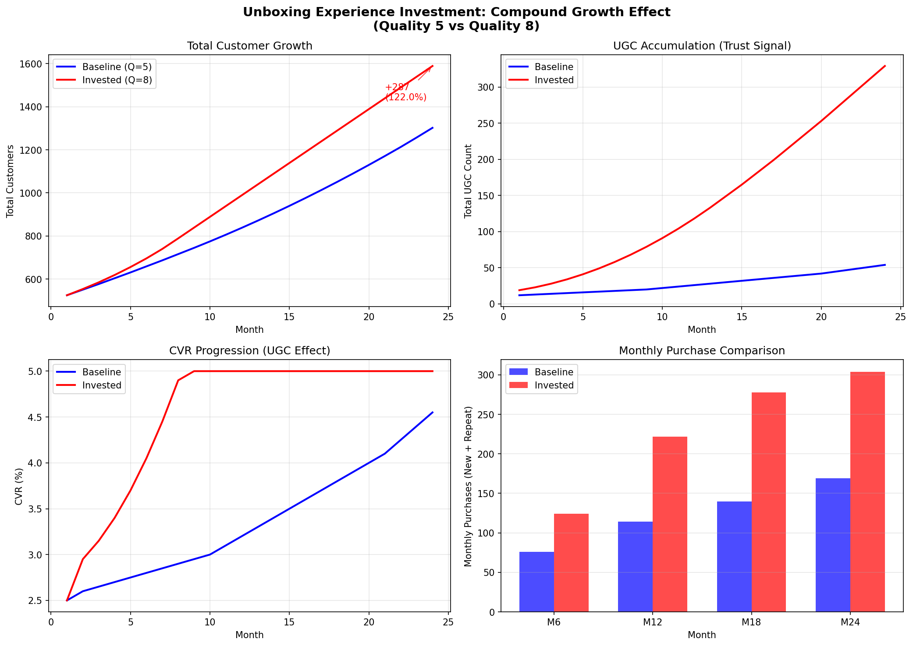

# EEZO 信頼醸成による複利成長シミュレーションレポート

## エグゼクティブサマリー

開封体験品質への投資（信頼品質スコア 5→8）により、**5年間で+7,312万円の追加売上**が見込まれる。初年度の売上差は+287万円（+40%）だが、複利効果により5年目には+7,312万円（+124%）まで拡大する。

---

## 1. シミュレーション概要

### 1.1 目的
北海道食材EC「EEZO」における開封体験品質への投資が、信頼醸成を通じて売上にどのような複利効果をもたらすかを定量的に検証する。

### 1.2 シミュレーション期間
60ヶ月（5年間）

### 1.3 比較シナリオ
| シナリオ | 信頼品質スコア | 説明 |
|----------|---------------|------|
| ベースライン | 5.0 | 現状維持（通常の開封体験） |
| 投資シナリオ | 8.0 | 開封体験品質への投資後 |

---

## 2. モデルの前提条件

### 2.1 基本パラメータ
| パラメータ | 値 | 説明 |
|-----------|-----|------|
| 月間サイト訪問者数 | 2,300人 | 広告・SEO等による流入 |
| 基準CVR | 1.5% | 信頼シグナルなしの場合 |
| 平均客単価 | 8,000円 | 1回あたりの購入額 |
| リピーター客単価係数 | 1.15倍 | リピーターは15%多く購入 |
| 初期顧客数 | 100人 | シミュレーション開始時点 |

### 2.2 信頼品質による影響

| 指標 | ベースライン (Q=5) | 投資後 (Q=8) | 変化 |
|------|-------------------|--------------|------|
| 月次再購入確率 | 8.0% | 12.5% | +4.5pt |
| 月次離脱率 | 3.0% | 1.5% | -1.5pt |
| UGC投稿率 | 1.0% | 3.4% | +2.4pt |
| 紹介率（年率） | 2.0% | 5.0% | +3.0pt |

### 2.3 複利メカニズム

```
信頼品質投資 (5 → 8)
       │
       ├─→ 再購入率↑ ──→ 顧客維持向上 ─────────┐
       │                                      │
       ├─→ 離脱率↓ ───→ 顧客ベース拡大 ───────┤
       │                                      │
       ├─→ UGC率↑ ───→ 信頼シグナル蓄積 ─────┤
       │                                      ↓
       └─→ 紹介率↑ ─────────────→ CVR改善（信頼効果）
                                             │
                                             ↓
                                  新規顧客増 × 高維持率
                                             │
                                             └──→ 複利ループ
```

---

## 3. シミュレーション結果

### 3.1 年次売上推移

| 年 | ベースライン | 投資シナリオ | 差額 | 成長率 |
|----|-------------|-------------|------|--------|
| 1年目 | 723万円 | 1,010万円 | +287万円 | +39.7% |
| 2年目 | 1,725万円 | 2,885万円 | +1,160万円 | +67.3% |
| 3年目 | 2,948万円 | 5,578万円 | +2,631万円 | +89.3% |
| 4年目 | 4,378万円 | 9,048万円 | +4,670万円 | +106.7% |
| **5年目** | **5,913万円** | **1億3,225万円** | **+7,312万円** | **+123.7%** |

### 3.2 最終状態比較（60ヶ月後）

| 指標 | ベースライン | 投資後 | 倍率 |
|------|-------------|--------|------|
| 累計売上 | 5,913万円 | 1億3,225万円 | 2.24倍 |
| 月次売上 | 131万円 | 374万円 | 2.86倍 |
| アクティブ顧客数 | 1,575人 | 2,979人 | 1.89倍 |
| 累計UGC数 | 50件 | 488件 | 9.76倍 |
| 有効UGC数（減衰後） | 30件 | 312件 | 10.47倍 |
| 最終CVR | 2.53% | 3.22% | 1.27倍 |
| 平均顧客LTV | 18,001円 | 30,321円 | 1.68倍 |

### 3.3 複利効果の分析

| 指標 | 倍率 | 増加率 |
|------|------|--------|
| 5年間累計売上 | 2.24倍 | +123.7% |
| 顧客ベース | 1.89倍 | +89.1% |
| 信頼シグナル（UGC） | 10.47倍 | +947.4% |

**5年間の追加売上**: 73,120,400円
**月平均増分**: 1,218,673円/月

---

## 4. 複利効果の詳細分析

### 4.1 なぜ差が加速するのか

1. **UGCの蓄積効果**: 信頼シグナルは時間と共に蓄積され、CVRを継続的に改善
2. **顧客ベースの拡大**: 低い離脱率により顧客が維持され、再購入の母数が増加
3. **紹介による獲得コスト削減**: 満足した顧客からの紹介が新規獲得を後押し
4. **LTVの向上**: 高い再購入率により、顧客1人あたりの生涯価値が上昇

### 4.2 年次成長率の推移

| 年 | 投資シナリオの対ベースライン成長率 |
|----|----------------------------------|
| 1年目 | +39.7% |
| 2年目 | +67.3% |
| 3年目 | +89.3% |
| 4年目 | +106.7% |
| 5年目 | +123.7% |

→ 毎年約20-30ポイントずつ差が拡大（複利効果の証左）

---

## 5. 感度分析

### 5.1 主要パラメータの影響度

| パラメータ | 売上への影響度 | 備考 |
|-----------|--------------|------|
| 再購入率 | ★★★★★ | LTVに直結、最も重要 |
| 離脱率 | ★★★★☆ | 顧客ベース維持に影響 |
| UGC率 | ★★★☆☆ | 長期的なCVR改善に寄与 |
| 紹介率 | ★★☆☆☆ | 獲得コスト削減効果 |

### 5.2 リスク要因

- UGCの品質低下（ネガティブレビューの増加）
- 競合の体験品質向上
- 市場環境の変化（訪問者数の減少）

---

## 6. 結論と推奨事項

### 6.1 結論

開封体験品質への投資は、単なる顧客満足度向上にとどまらず、**複利的な売上成長エンジン**となる。初年度の投資対効果は+40%だが、5年目には+124%まで拡大し、累計で**+7,312万円**の追加売上を生む。

### 6.2 推奨事項

1. **即座に開封体験品質への投資を開始**
   - 複利効果は早く始めるほど大きくなる

2. **UGC促進施策の強化**
   - レビュー投稿インセンティブ
   - SNSシェア機能の改善

3. **離脱防止施策の優先**
   - 離脱率の低減は顧客ベース維持に直結

4. **KPIモニタリングの設定**
   - 月次再購入率、UGC投稿数、CVRを定期追跡

---

## 付録

### A. グラフ



### B. シミュレーションコード

`src/simulation.py` を参照

### C. パラメータ調整方法

```python
# src/simulation.py 内の SimulationParams を編集
@dataclass
class SimulationParams:
    trust_quality: float = 8.0  # 信頼品質スコアを変更
    monthly_visitors: int = 2300  # 訪問者数を変更
    # ... その他パラメータ
```

---

*レポート生成日: 2026年1月30日*
*シミュレーションバージョン: 厳密版 v2.0*
